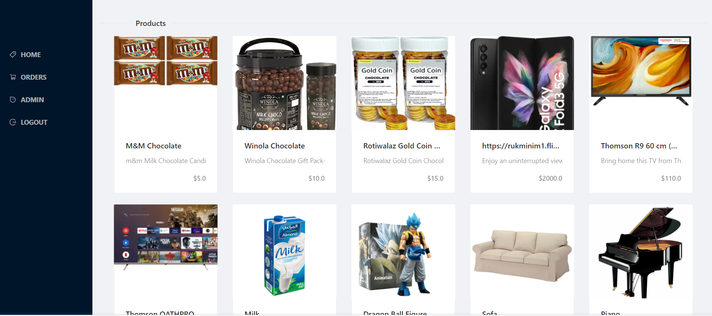

## FLIPCART

> FlipCart is a single page app that permits users to see products, place orders and see your list of orders. You can check the back-end version using [FlipCart-backend](https://github.com/Hector096/FlipCart-backend)

---

## Credentials

To login as an admin please use this credentials:

Email: leandro1@admin.com
password: leandro@1998

## Live Demo

[FlipCart Website](https://deploy-preview-4--peaceful-meninsky-cc6a1e.netlify.app)

## Screen-Shot

## Built With

- React
- JavaScript
- CSS
- Redux
- VsCode

## Getting Started

To get a local copy of this project just do the following:

- Clone the repository using `https://github.com/Hector096/FlipCart.git`
- Browse into the project's directory using `cd FlipCart`
- Install all the dependencies using `npm install`
- Start the server using `npm start`

## Authors

👤 **Vishal Verma**

- GitHub: [@Hector096](https://github.com/Hector096)
- LinkedIn: [@hector096](https://www.linkedin.com/in/hector096/)

👤 **Leandro Barreto**

- Github: [@Leandro-Barretoo](https://github.com/Leandro-Barretoo)
- Linkedin:[@Leandro Barreto](https://www.linkedin.com/in/leandroobarreto/)

## 🤝 Contributing

Contributions, issues, and feature requests are welcome!

Feel free to check the [issues page](https://github.com/Hector096/PokeApp/issues).

## Show your support

Give a ⭐️ if you like this project!

## Acknowledgments

- As required by the Creative Commons License, we give appropriate credit to the author of the original design who is Murat Korkmaz.

- Thanks to the Microverse team for the great curriculum.

## 📝 License

This project is [MIT](./MIT.md) licensed.
